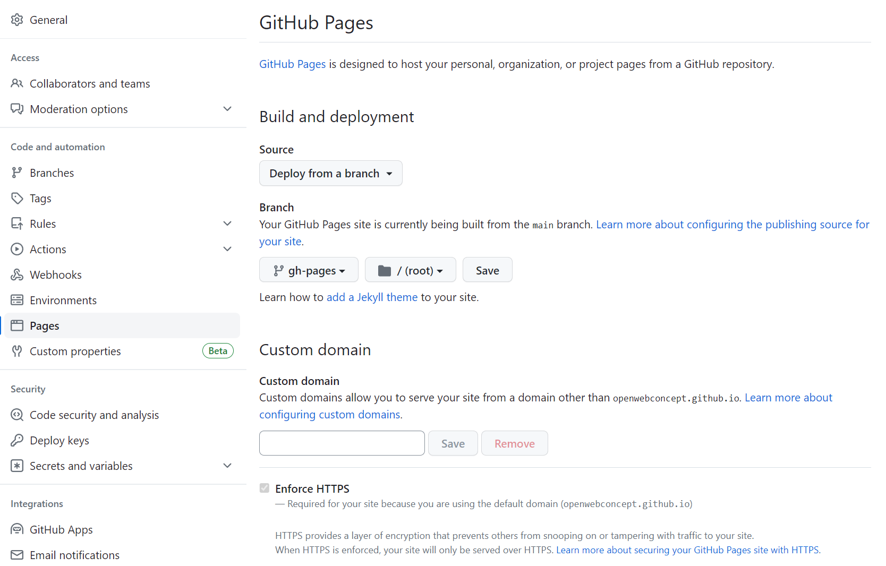
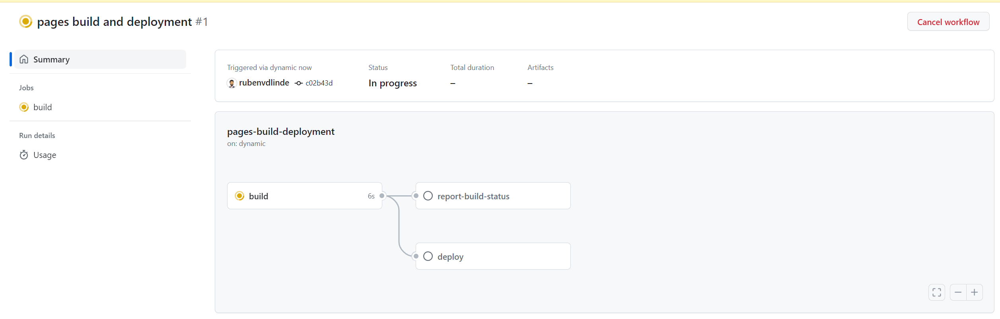
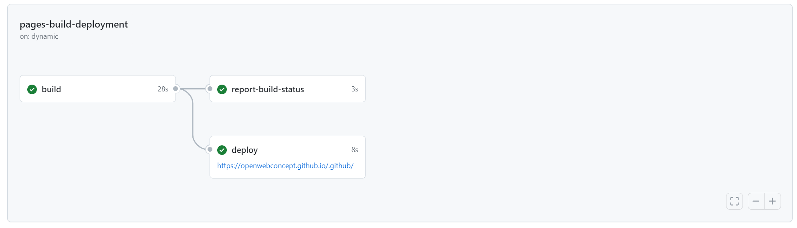

# Open Catalogi action
This action builds on organisation specific Open Catalogi page as static github page.|

## Usage
To use this action, simply include it as a step in your workflow file. No inputs are required.

````yaml
name: My Open Catalogi Workflow

on:
  schedule:
    - cron: '0 0 * * *'

jobs:
  build:
    runs-on: ubuntu-latest
    steps:
      - name: Deploy Open Catalogi Github Page
        uses: OpenCatalogi/opencatalogi-action@latest
````

In the above example an page is created or updated every night at 0:00, we advise this route becouse you will autmaticly suplied with fixes and new features. You can however also choose other options to trigger a page build

To trigger a page build whenever you commit something to the main  branche
````yaml
on:
  push:
    branches:
      - main
````

To gain a bit more control and only trigger a page build manually usw
````yaml
on:
  workflow_dispatch:
````
> **Warning**
> If you do not supply the action with an access token or an SSH key, you must access your repositories settings and provide `Read and Write Permissions` to the provided `GITHUB_TOKEN`, otherwise you'll potentially run into permission issues. Alternatively you can set the following in your workflow file to grant the action the permissions it needs.

```yml
permissions:
  contents: write
```

> **Note**
> When you first run the workflow you need to `manually` activate github pages on your repository! Head over to setting -> pages. Select `deploy form a branch` as a source and `gh-pages` as your branche (unles you configured the page to be build in a differend branche)
> 
> Afther pressing save head over tot the actions and take a look at the `pages build and deployment` action
> 
> When it is done it will also tell you under wich link you can find your page
> 


## Inputs

| Input Name                          | Description                                                                                             | Required | Type    | Default Value                                                            |
|------------------------------------|---------------------------------------------------------------------------------------------------------|----------|---------|--------------------------------------------------------------------------|
| `env_vars_set`                     | Whether to use the env variables set in this file, set to false to use env variables of the OpenCatalogi config files   | Yes       | boolean  | `true`                                                               |
| `github_pages_branch`               | The branch on which the GitHub page will be built (Optional)                                            | No       | string  | `gh-pages`                                                               |
| `github_repository_name_as_prefix`  | Whether to use the GitHub repository name as a prefix (Optional)                                        | No       | boolean | `true`                                                                   |
| `repository`                        | The GitHub repository to use (could be an external repository) (Optional)                               | No       | string  | `${{ github.event.repository.name }}`                                     |
| `pull_from_branche`                | The branch on which to base the build (Optional)                                                        | No       | string  | `main`                                                                   |
| `me_url`                            | The profile URL used (Optional)                                                                         | No       | string  | `https://api.opencatalogi.nl/api/users/me`                                |
| `api_url`                           | The location of the Open Catalogi API (change if you are running your own API) (Optional)               | No       | string  | `https://api.opencatalogi.nl/api`                          |
| `admin_url`                         | The admin (dashboard) URL used (Optional)                                                               | No       | string  | `https://api.opencatalogi.nl/admin`                                       |
| `base_url`                          | The BASE location of the Open Catalogi API (change if you are running your own API) (Optional)          | No       | string  | `https://api.opencatalogi.nl`                          |
| `frontend_url`                      | The location (URL) of this Open Catalogi installation (Optional)                                        | No       | string  | `https://api.opencatalogi.nl`                                            |
| `login_redirect`                    | The path for login redirection (Optional)                                                               | No       | string  | `vault`                                                                  |
| `admin_dashboard_url`               | The location of the Open Catalogi dashboard (Optional)                                                  | No       | string  | `https://admin.opencatalogi.nl`                                          |
| `nl_design_theme_classname`         | The class name of the desired NL design theme (Optional)                                                | No       | string  | `open-webconcept-theme`                                                  |
| `arrow_breadcrumbs`                 | Whether to use arrow breadcrumbs instead of the normal breadcrumbs (Optional)                           | No       | boolean | `false`                                                             |
| `start_page`                        | When given, shows a readme file instead of the normal start page (Optional)                             | No       | string  | `false`       
| `filter_rating`                        | What kind of rating must be shown, OpenCatalogi or Commonground (Optional)                             | No       | string  | `OpenCatalogi`                                             |
| `favicon_logo`                      | A base64 encoded SVG file or URL to the logo used as favicon (Optional)                                 | No       | string  | `https://openwebconcept.nl/wp-content/themes/openwebconcept/assets/src/images/logo@2x.png` |
| `page_title`                        | The title for the website / gitpage (Optional)                                                          | No       | string  | `${{ github.event.repository.name }}`                                     |
| `navbar_logo`                       | An base64 encoded SVG file or URL to the logo used in the main menu (Optional)                          | No       | string  | `https://openwebconcept.nl/wp-content/themes/openwebconcept/assets/src/images/logo@2x.png` |
| `navbar_show_login`                 | Shows the inloggen option (Optional)                                                                    | No       | boolean | `false`                                                                 |
| `navbar_content`                    | A link to the JSON file that manages the footer content (Optional)                                      | No       | string  | `https://raw.githubusercontent.com/OpenCatalogi/web-app/348679b7537b20e51767dfdc6086349602afe219/pwa/src/templates/templateParts/header/HeaderContent.json` |
| `jumbotron_title`                   | The title of the jumbotron (Optional)                                                                   | No       | string  | `${{ github.event.repository.name }}`                                     |
| `jumbotron_subtitle`                | The (short) subtitle used in the jumbotron (Optional)                                                   | No       | string  | `Product page`                                                           |
| `jumbotron_description`             | The (long) description included in the jumbotron (Optional)                                             | No       | string  | `${{ github.event.repository.description }}`                               |
| `jumbotron_searchform`              | Whether or not to display the search form in the jumbotron (Optional)                                   | No       | boolean | `false`                                                                 |
| `jumbotron_iscard`                  | Put the content of the jumbotron within a card (Optional)                                               | No       | boolean | `false`                                                                 |
| `jumbotron_image_placement`         | The position of the jumbotron image ("false", "background","right" ,"left") (Optional)                  | No       | string  | `false`                                                                 |
| `jumbotron_image_url`               | An base64 encoded SVG file or URL to the logo used in the jumbotron (Optional)                          | No       | string  | `false`                                                                 |
| `footer_logo`                       | An base64 encoded SVG file or URL to the logo used in the footer (Optional)                             | No       | string  | `https://openwebconcept.nl/wp-content/themes/openwebconcept/assets/src/images/logo@2x.png` |
| `footer_content`                    | A link to the JSON file that manages the footer content (Optional)                                      | No       | string  | `https://raw.githubusercontent.com/OpenCatalogi/web-app/25995205e1dbb043822d1c58c5c23f8e6f77ff7e/pwa/src/templates/templateParts/footer/FooterContent.json` |
| `footer_show_creator`               | Shows the "With love from conduction" link in the footer (Optional)                                     | No       | boolean | `true`                                                                  |
| `git_name`                          | Git name configuration for the commit (Optional)                                                        | No       | string  | `Open Catalogi bot`                                                     |
| `git_mail`                          | Git mail configuration for the commit (Optional)                                                        | No       | string  | `bot@opencatalogi.nl`                                                   |
| `git_commit_message`                | The description for the commit (Optional)                                                               | No       | string  | `${{ github.event.repository.html_url }}`                                 |
| `github_organization_url`           | The repository to which the results are limited (used to only look in your own organisation) (Optional) | No       | string  | `https://github.com/${{ github.repository_owner }}`                       |


## Output

| Output Name     | Description                                                              |
|-----------------|--------------------------------------------------------------------------|
| `page`          | A zip of the build page                                                 |

## Tips
Besides making creating a frontend for your catalogue its also a goed idea to define how your organisation uses open source. Luckily this is verey easilly don by adding the publiccode action to your workflow 

````yaml
name: My PublicCode Workflow

on:
  push:
    branches:
      - main

jobs:
  build:
    runs-on: ubuntu-latest
    steps:
      - name: Deploy Product Github Page
        uses: OpenCatalogi/productpage-action@latest
      - name: Update opencatalogi.yaml
        uses: OpenCatalogi/publiccode-action@latest
````

[Read more](https://github.com/marketplace/actions/create-or-update-publiccode-yaml) about the publiccode action that also creates the opencatalogi.yaml

## Working with branche protection
Keep in mind that this action creates/updates a file and force pushes into the beanche it was run on. It is therfore incompatible with github branche protection ON THE SAME branche. You can hower the wrokflow to start higher up in the branche tree to circumvent this. e.g. if you normaly work with a branche setup like:

- Master (protected)
- - Development (protected)
- - - Feature-1
- - - Feature-1

You can configure the workflow to trigger on

````yaml
on:
  push:
    branches:
      - 'feature-*'
````

The adjusted publiccode or opencatalogi files will then come allong in you normal pull requests from `feature-x` to `developement`etc.

## Special thanxs
As is the case with most software this action is based on the work of others, and uses there code. We would like to give a special shout out to the following parties and thier code

- [James Ives | github-pages-deploy-action#readme](https://github.com/JamesIves/github-pages-deploy-action#readme]).
- [SpicyPizza | create-envfile](https://github.com/SpicyPizza/create-envfile).

## Maintainers
This software is maintained by [Conduction b.v.](https://conduction.nl/)

## License
© 2023 Conduction B.V.

Licensed under the EUPL. The version control system provides attribution for specific lines of code.

## Remarks
This GitHub Action is published in the GitHub Marketplace. As such, you can find the [Terms of Service here](). Also, [here]() you can find the GitHub Marketplace Developer Agreement.
